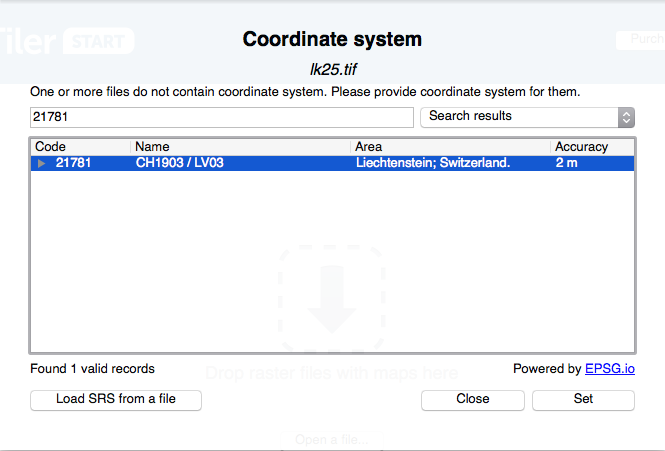

lk25-maptiles
=============

Map data for use with kufi.if-control, includes a simple local tileserver

## Updating the Map

### Prerequisites

- A copy of [Maptiler Start](http://www.maptiler.com/pricing/).
- A source image for your map tiles. Maptiler happily handles nearly every image format.

### Generate A Tileset with Maptiler

- Run maptiler and chose `Mercator Tiles`. Drop the source image in the next screen.
- A dropdown asking for a coordinate system will appear. Enter `21781` into the search field and select the only entry that appears:

    

- On the next screen, you'll see a small preview of your map region. Click `continue`.
- The next screen lets you set the desired __output folder__ and __zoom levels__. Select `Folder`, and then pick the zoom range.

    For the demo, we've set fixed zoom levels for each map type (If you want to know why, read [Determining the Correct Zoom Ranges] below):

    - __lk25:__
        - minZoom: 13
        - maxZoom: 16

    - __swissimage:__
        - minZoom: 11
        - maxZoom: 18

    - __up:__
        - minZoom: 11
        - maxZoom: 16

    Click `render` and select this repository's root folder as a target
- Commit the changes and push to remote.
- The three map repos are automatically redeployed every 10 minutes, and will then be available in the app.

## Determining the Correct Zoom Ranges

__Note:__ This is for future considerations and background knowledge.

__Determining the ideal zoom range can be tricky__ and varies from source to source. 11 to 16 seems a decent starting point, and Maptiler will also set the maximum to whatever your source file can reasonably support, because zooming in further than the native resolution of the source will look bad.

Output your map to this repo's root folder and check the combined size of the numbered folders you just generated (in this case, you'll get `11, 12, 13, 14, 15 and 16`, all containing map tiles). You're aiming for less than 30mb per layer, if possible. If a client choses to offline all map layers, that would be nearly 100mb stored on the device, which should be fine. Be aware that each zoom layer will usually be __triple__ the size of the previous one. If you have a 30mb tile set, adding a single zoom layer will increase the size to about 80mb, adding one more will be about 240mb. Since there are three maps in the app, this would probably not be such a good idea.

## Local Usage

Clone this repo somewhere and run `python corsserver.py` in it. This will start a local server on port 8000, which you can access at `0.0.0.0:8000`, `127.0.0.1:8000` or your local network IP, `192.168.???.???:8000`. It sends super friendly CORS headers so you can access it from everywhere.

The tile URL scheme is `hostName+':8000/{z}/{x}/{y}.png'`, in this particular case in CRS EPSG 21781, if you find your offsets are weird, this is why.
